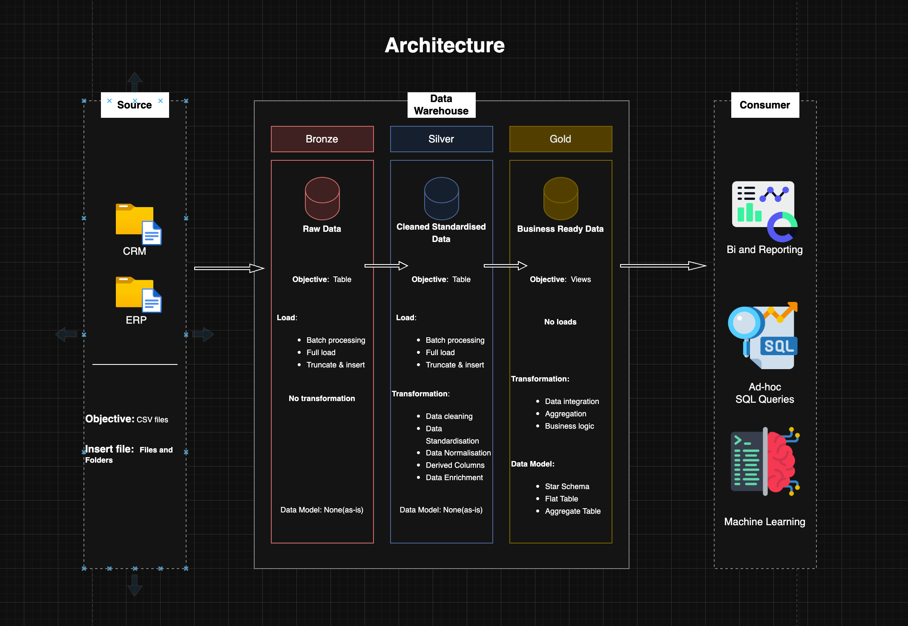
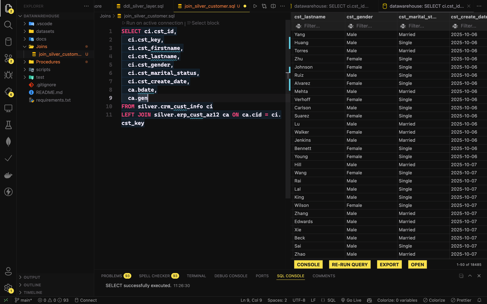
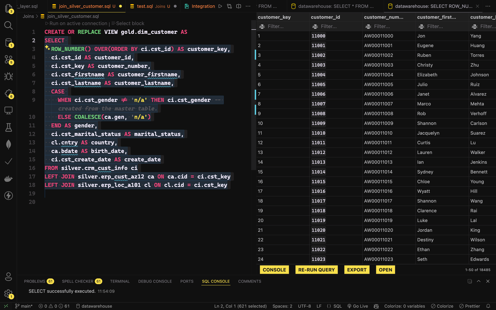
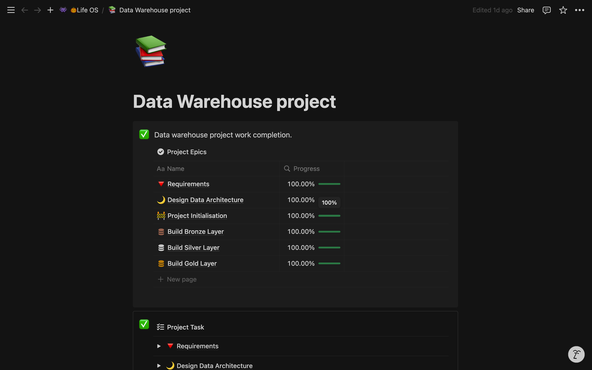
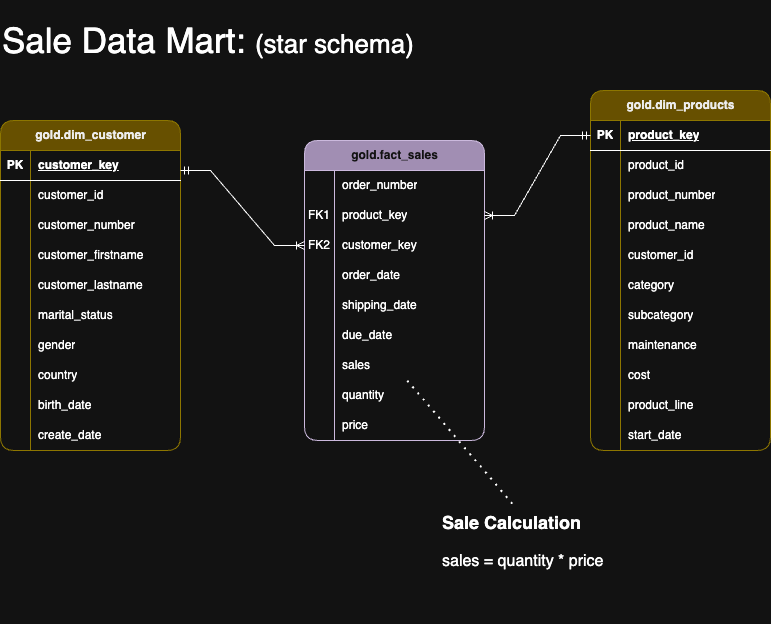
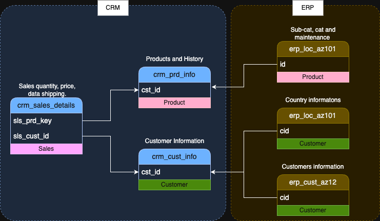

# 🏠<u>Data Warehouse and Analytics Project</u>

- This repository showcases a comprehensive data warehousing and analytics solution, covering the end-to-end data pipeline—from data ingestion and transformation to business intelligence and insights generation.

- Designed as a portfolio project, it demonstrates industry best practices in data engineering, ETL processes, and analytical modeling, enabling efficient data-driven decision-making. This project serves as a blueprint for building a scalable and structured data warehouse architecture that supports business intelligence and reporting.

---

## ⚙️ Data Architect

Basic Data Architect use for this Project to build bronze, silver and gold layers.


1. **Bronze Layer**: The raw data storage layer, where data is ingested directly from source systems (e.g., CSV files) into the **SQL Server database** without modifications. This layer acts as a **staging area**, preserving the original data for historical reference and traceability.
2. **Silver Layer**: The data transformation layer, where raw data undergoes **cleansing, standardization, and normalization** to ensure consistency, accuracy, and integrity, making it suitable for deeper analysis.
3. **Gold Layer**: The business-ready layer, where data is **modeled into a structured star schema**, optimized for **reporting, analytics, and decision-making**.

---

## 📖 Project Overview

This project involves:

1. **Data Architecture**: Designing a Modern Data Warehouse using the Medallion Architecture **Bronze**, **Silver**, and **Gold** layers.
2. **ETL Pipelines**: Extracting, transforming, and loading data from source systems into the warehouse.
3. **Data Modeling**: Developing fact and dimension tables optimized for analytical queries.
4. **Analytics & Reporting**: Creating SQL-based reports and dashboards for actionable insights.

This repository is an excellent resource for professionals and students looking to showcase expertise in:

- SQL Development
- Data Architecture
- Data Engineering
- ETL Pipeline Development
- Data Modeling
- Data Analytics

---

## 🚀 Project Requirements

### Building the Data Warehouse (Data Engineering)

#### Objective

Develop a modern data warehouse using SQL Server to consolidate sales data, enabling analytical reporting and informed decision-making.

#### Specifications

- **Data Sources**: Import data from two source systems (ERP and CRM) provided as CSV files.
- **Data Quality**: Cleanse and resolve data quality issues prior to analysis.
- **Integration**: Combine both sources into a single, user-friendly data model designed for analytical queries.
- **Scope**: Focus on the latest dataset only; historization of data is not required.
- **Documentation**: Provide clear documentation of the data model to support both business stakeholders and analytics teams.

---

### ⚙️ ETL (Extract Transform and Load)

- The ETL process is the backbone of this data warehouse project, ensuring seamless data ingestion, transformation, and integration from multiple sources into a structured analytical model. This project follows a layered Medallion Architecture (Bronze, Silver, Gold) to progressively refine raw data into a business-ready format for reporting and analytics.

### ⚙️ Tools used:

- VS code:
  
  
- Git version control
- Notion
  
- Draw
  
- Integrations:
  

### 📈 BI: Analytics & Reporting (Data Analysis)

#### Objective

Develop SQL-based analytics to deliver detailed insights into:

- **Customer Behavior**
- **Product Performance**
- **Sales Trends**

These insights empower stakeholders with key business metrics, enabling strategic decision-making.

For more details, refer to the project documentation.

---

## 📂 Repository Structure

```
data-warehouse-project/
│
├── datasets/                           # Raw datasets used for the project (ERP and CRM data)
│   ├── source_crm/                     # CRM data sources
│   ├── source_erp/                     # ERP data sources
│
├── docs/                               # Project documentation and architecture details
│   ├── data_catalog.md                 # Catalog of datasets, including field descriptions and metadata
│
├── images/                             # Visual representation of project components
│   ├── Architecture.drawio.png         # Data architecture diagram
│   ├── Integration_model.drawio.png    # Integration model representation
│   ├── data_model.drawio.png           # Data model schema diagram
│
├── scripts/                            # SQL scripts for ETL and transformations
│   ├── ddl_bronze_layer.sql            # Schema definition for Bronze Layer
│   ├── ddl_silver_layer.sql            # Schema definition for Silver Layer
│   ├── ddl_gold_layer.sql              # Schema definition for Gold Layer
│   └── main.sql                         # Main execution script for DDLs
│
├── Procedures/                         # Stored procedures for batch processing
│   ├── bronze_layer_batch.sql          # Batch processing for Bronze Layer
│   ├── bronze_layer_truncate.sql       # Truncate script for Bronze Layer
│   ├── silver_layer_batch.sql          # Batch processing for Silver Layer
│
├── Joins/                              # SQL scripts for table joins
│   ├── join_silver_customer.sql        # Joins related to Silver Customer table
│   ├── test.sql                         # Test join queries
│
├── tests/                              # Test scripts and quality checks
│   └── test.sql                        # SQL test cases
│
├── README.md                           # Project overview and instructions
├── LICENSE                             # License information for the repository
├── .gitignore                          # Files and directories to be ignored by Git
├── requirements.txt                    # Dependencies and requirements for the project
```

---

### 🪪 License

This project is licensed under the [MIT License](LICENSE). You are free to use, modify, and share this project with proper attribution.

### 👋 About Me

Hi there! I'm Saquib Hazari passionate Data Analyst and enthusiast. Feel free to reach out to me from the blow links.

[](https://www.linkedin.com/in/saquib-hazari/) [](https://x.com/saquib7298) [](https://discord.gg/FJBZBbgC) [](<[https://YOUR_WEBSITE.com](https://saquibhazari-portfolio.vercel.app/)>)
